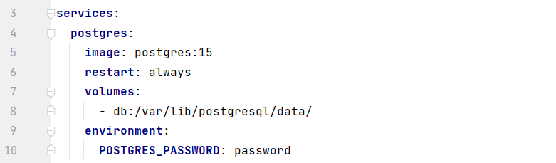
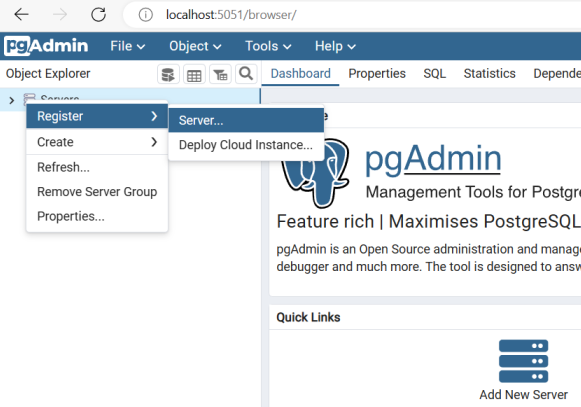
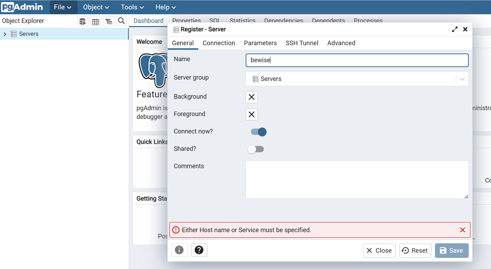
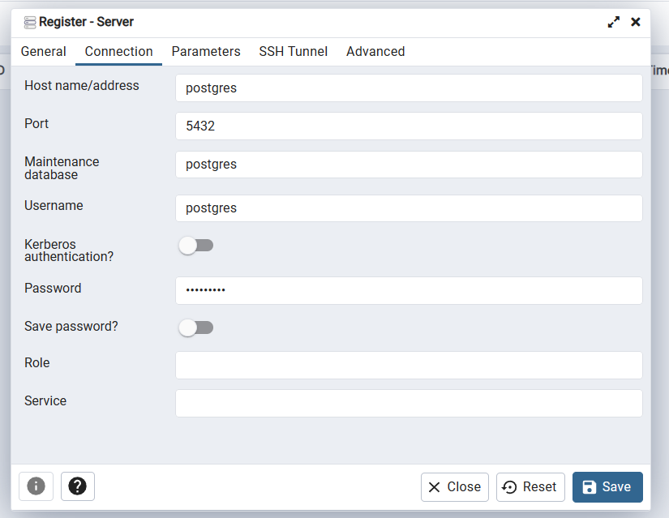
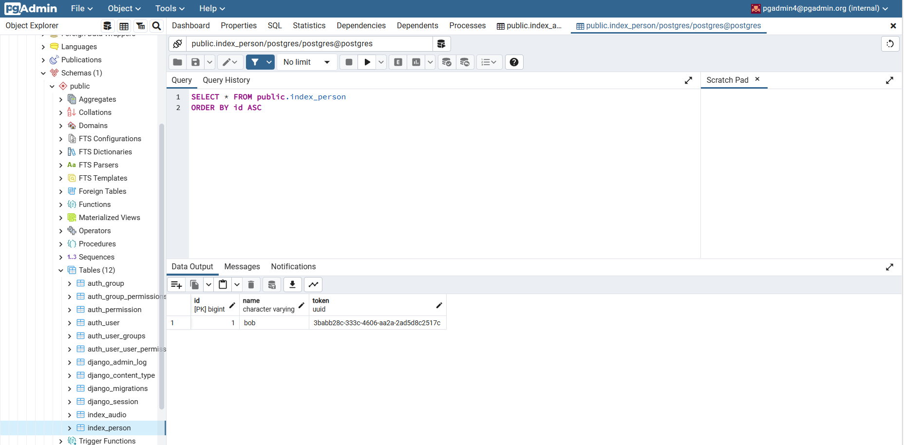
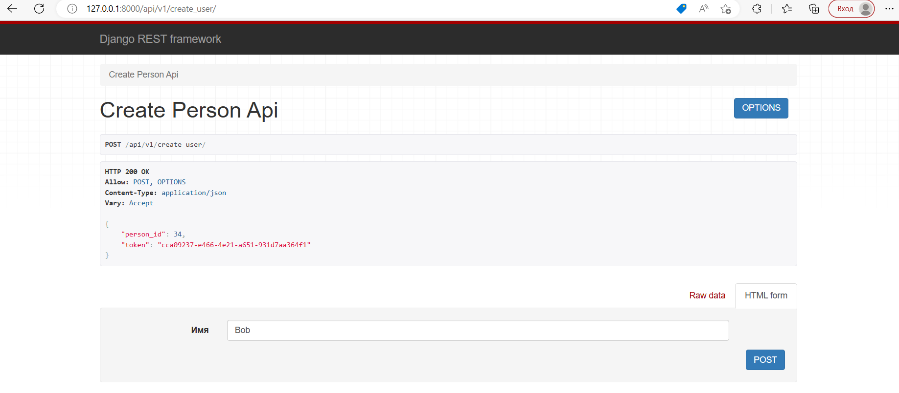
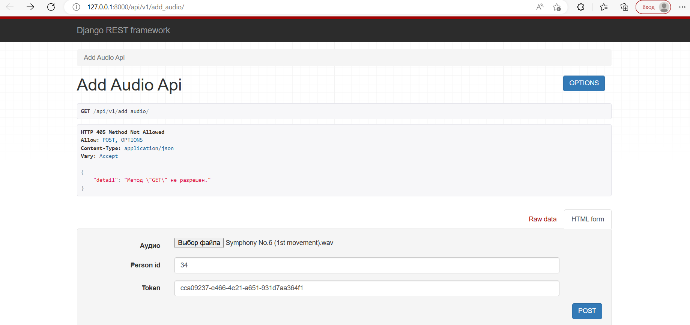
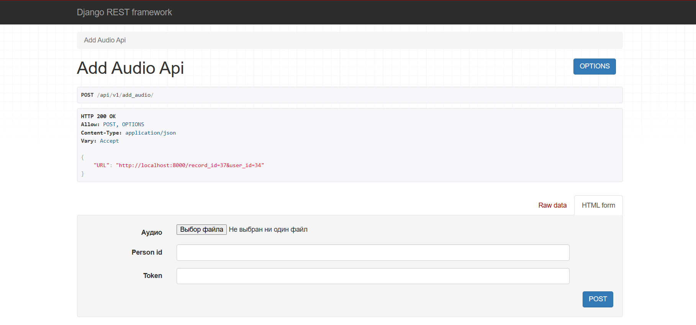
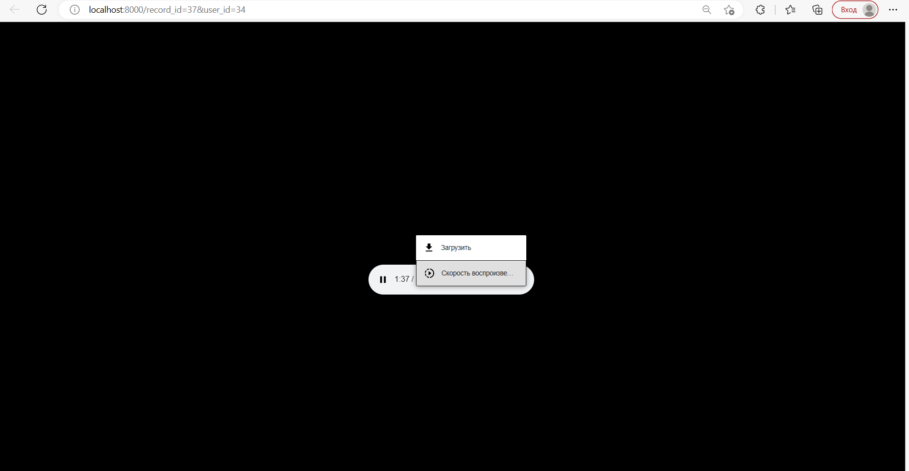

# Задание 2

## Описание
>В сервисе реализованы следующие методы:
> - POST - <b>создание пользователя</b>, принимает на вход запросы с именем пользователя и создает в
> базе данных пользователя с заданным именем, так же генерирует уникальный ID и токен
> доступа. Возвращает ID и токен;
> - POST - <b>добавление аудиозаписи</b>, принимает на вход запросы, содержащие ID пользователя, токен
> доступа и аудиозапись в формате wav, преобразует аудиозапись в формат mp3, генерирует для нее уникальный UUID
> идентификатор и сохраняет их в базе данных, возвращает URL для скачивания записи с возможностью скачать.

## Стек технологий

>Язык: __Python 3__<br>
Web framework: __Django & DRF__<br>
База данных: __PostgreSQL__<br>

Другое: Docker

## API views

> - <p>api/v1/create_user — POST запрос на создание пользователя;<br>
> - <p>api/v1/add_audio — POST запрос на добавление аудиозаписи;<br>

## urls

> - /record_id=id&user_id=user_id — прослушивание и загрузка аудиозаписи

## Приватная информация

>Скрытая информация в файле .env:<br>
>>PASSWORD=пароль от postgres<br>
SECRET_KEY=django key<br>


## Запуск
1. Склонируйте репозиторий и перейдите в директорию проекта, активируйте виртуальное окружение:
```
git clone https://github.com/anton431/bewise_2.git
```
2. Установите все необходимые зависимости  и заполните файл .env:
```
pip install -r requirements.txt
```
3. Установите пароль от вашей базы данных в docker-compose в переменной POSTGRES_PASSWORD:


4. Выполните команды:
```
docker-compose build
```
```
docker-compose up
```
5. Создайте суперпользователя django и заполните требуемые поля (необязательный пункт):

- Для этого найдите CONTAINER ID образа bewise командой:
```
docker ps -a
```
- Создайте суперпользователя и войдите в <a href=http://localhost:8000/admin>админку</a>:
```
docker exec -it <CONTAINER ID> python manage.py createsuperuser
```
6. В проекте используется PostgreSQL, зайдите в <a target="_blank" href=http://localhost:5051/login>pgAdmin</a> с помощью email и пароля:
```
pgadmin4@pgadmin.org
```
```
root
```

7. Зарегистрируйте сервер: <br>
>

>

> Пароль вашей PosgreSQL

> Цель достигнута

8. Можно выполнять запросы:
>  <a href=http://127.0.0.1:8000/api/v1/create_user/>Запрос</a> на создание пользователя

>   <a href=http://127.0.0.1:8000/api/v1/add_audio/>Запрос</a> на добавление аудиозаписи

>  Возможность слушать и загрузить аудио в mp3 формате по URL типа: http://localhost:8000/record_id=<int>&user_id=<int>

9. Запуск без docker:
- выполните пункты 1 и 2;
- заполните DATABASES в settings.py в соответствии с Вашим PostgreSQL;
- выполните следующие команды:
```
python manage.py makemigrations
```
```
python manage.py migrate
```
```
python manage.py runserver
```
```
python manage.py createsuperuser
```
- можно пользоваться сервисом.